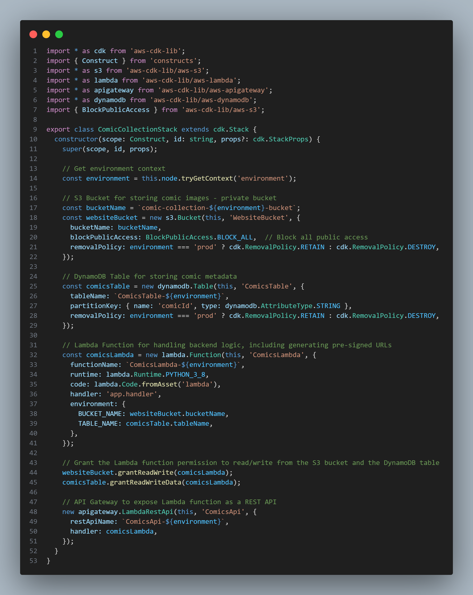
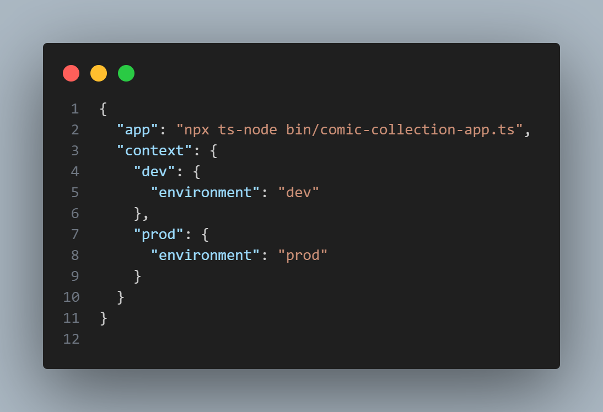
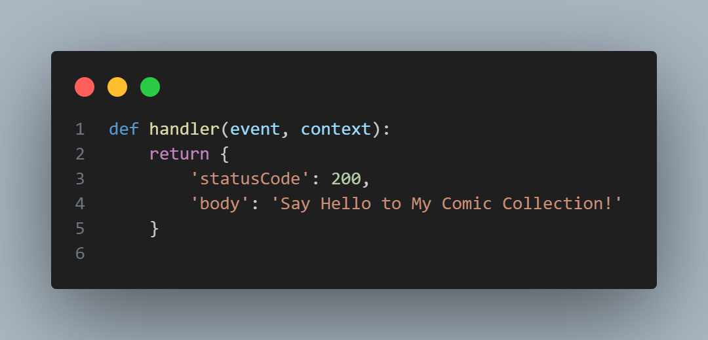
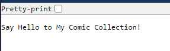

# Granular Development Log - Step by Step

## Week 1: Project Setup and Initial Infrastructure

**Date:** 2024-08-14  
**Basic Infrastructure and Getting Started**  
The goal here is to create the initial environment to start developing.  I will be using AWS CDK to deploy infrastructure, my code repo will be in Github.  I will be using Dev and Prod stacks to ensure I'm not introducing problems into production.  
1. Set up an empty Github repo. This is because when I want to `cdk init`, it's easier on an empty git repo.
2. Cloned the repo to local `git clone`
3. Initialized the AWS CDK project with `cdk init`.
4. Set up the basic infrastructure, including S3, API Gateway, and DynamoDB in a Typescript CDK. I'm designing this app to have a Dev and Prod environment as defined with CDK Context variables. I had to ensure that public access to the S3 bucket was blocked, otherwise CDK would give me a warning. I'll add the Lambda a few steps later. 
    

5. Created Docs directory for collecting documents such as this Development Log. Within that, I created an images directory to add screenshots such as the one above. At the time of this writing, I'm unsure as to how this might appear in Github due to the local path of the images. We'll have to see!

6. I updated the cdk.json with the Environment Contexts. 
   
7. I created a Lambda directory in my app directory and created a simple Lambda function in `lambda/app.py` 
   
8. Initiliazed Git with `git init` and committed and pushed to Github.
9. I deployed my CDK to the Dev environment on AWS with `cdk deploy --context environment=dev`. This creates an API Gateway endpoint for the Dev run.
10. Tested out the Dev run. I like it!
11. Deploy the CDK to the Prod environemnt with `cdk deploy --context environment=prod`
12. Tested the app and all is well. This is what the output looks like for now. 
    
13. This is about all I could do on my lunch break (I reused some code I previously had prepared) so I'll have to come back when I have more time!  
**Setting up CI/CD in AWS CDK** 
In this next section, I aim to establish a robust and automated deployment pipeline for my comic collection app. By integrating AWS CodePipeline and CodeBuild with my existing AWS CDK infrastructure, I’ll ensure that every change I push to my GitHub repository is automatically tested, built, and deployed to the production environment with minimal manual intervention. This setup will allow me to confidently push updates, knowing that any issues will be caught early through automated testing. My goal is to create a seamless, scalable development workflow that not only accelerates my ability to deliver features but also demonstrates my forward-thinking approach to software engineering and quality assurance.
 

 

1. Install the necessary CDK packages with `npm install @aws-cdk/aws-codepipeline @aws-cdk/aws-codepipeline-actions @aws-cdk/aws-codebuild @aws-cdk/aws-s3 @aws-cdk/aws-s3-assets`

2. Build `pipeline-stack.ts` that sets up the CI/CD pipeline.
3. Credentials: since I want to pull code from my GitHub repo, I needed to store credentials in Secrets Manager and create an OAuth token.  It includes the Owner, token, repo, and branch name.
4. Update the `bin/comic-collection-app.ts` to include the existing Comic Collection App stack and the new Pipeline Stack.
5. Build `buildspec.yml` in the app directory.  This tells AWS CodeBuild how to build and test the app.
6. PROBLEM!  Upon `cdk deploy`, I've run into what looks like permissions errors.  I don't intend to pass in environment variables, and I also intend to solve everything via CDK so I'll need to make an IAM role that has permissions to access Secrets Manager, but for now, I must take a break.  Committing to a feature branch for now.